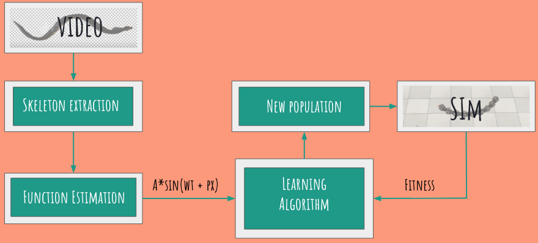

# Using Genetic Algorithms to mimic snake locomotion from Video on robots
## Course Project: CSE 598(Advances in Robot Learning): Shashank Rao Marpally, Nithish Moudhgalya, Sagar Seth
Summary:
1. Capture snake locomotion from real videos and extract locomotion function y=f(x) using image processing and spline fitting. 
2. Using the obtained function and other parameters like smoothness of motion and total distance moved to define a fitness function for the   genetic algorithm.
3. Benefit proposition: This method can be used to generalize snake locomotion across different species and terrains (in lieu of availability of data). Also, we perform a calculative mapping to ensure that robot joints can be mapped to actual snakes without need for increasing or decreasing number of joints in robot snake.

Make sure you have following files in your directory, in order to run the various examples:

1. sim.py
2. simConst.py
3. the appropriate remote API library: "remoteApi.dll" (Windows), "remoteApi.dylib" (Mac) or "remoteApi.so" (Linux)
4. simpleTest.py (or any other example file)
